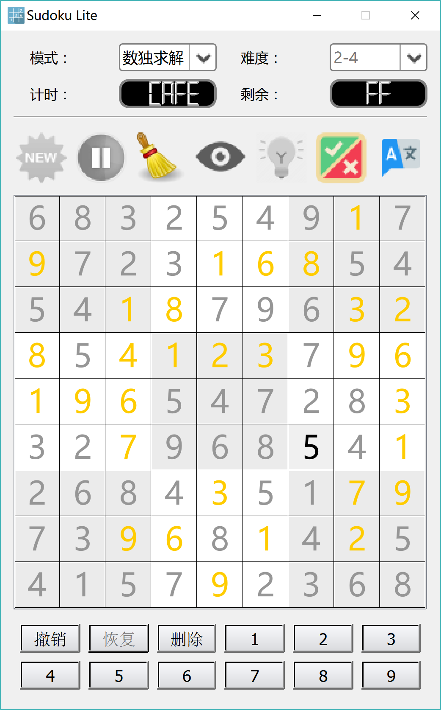
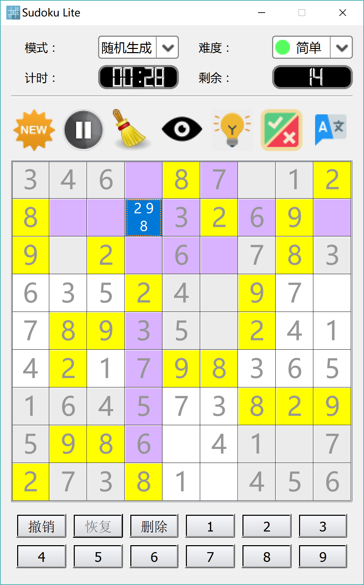
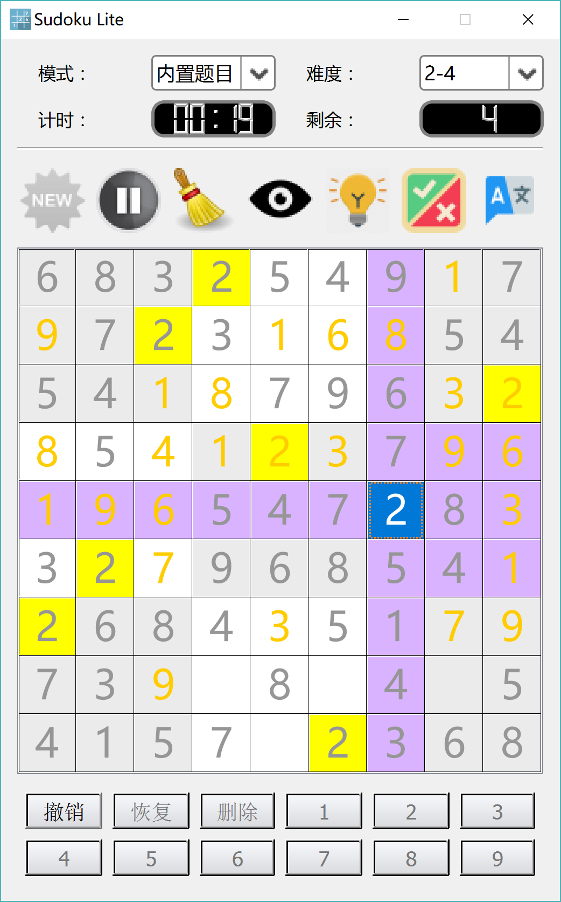
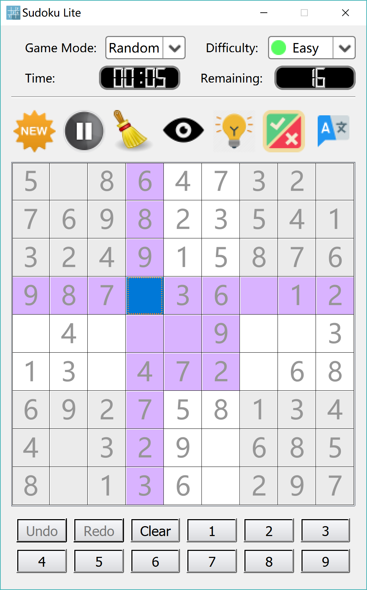

# SudokuLite

SudokuLite is a sudoku generator & solver in Qt. Assignment 1 of Programing and Training course, Tsinghua University, Summmer 2017.

This repository is not licensed. Use at your own risk.

## Building

Use `qmake` to build. Qt 5 and C++ 11 is required.

## Screenshots

Sudoku solver:

Sudoku generator:

Pre-generated sudokus:

English UI:

